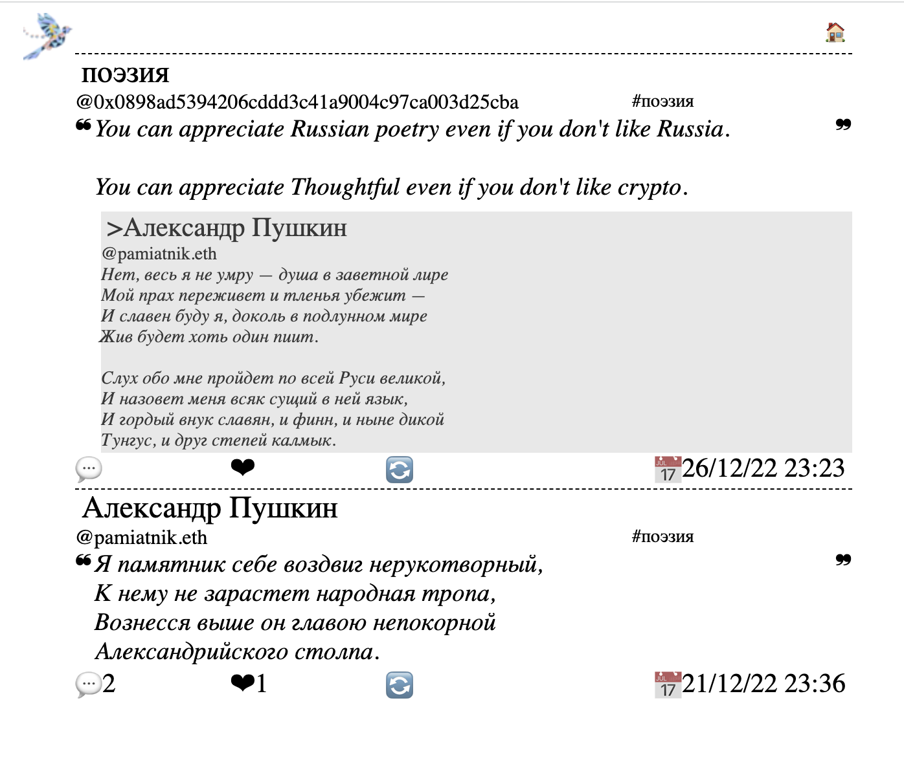

# Thoughtful3

Thoughts are stored on Ethereum.

Requires 510,686 gas to publish a thought. About $8 dollars at current price.

Make every word count.

Supported likes, retweets and threads (replies).

# Reading Thoughtful3

You can see the feed and post your thoughts [here](https://thoughtful3.eth.limo/)

